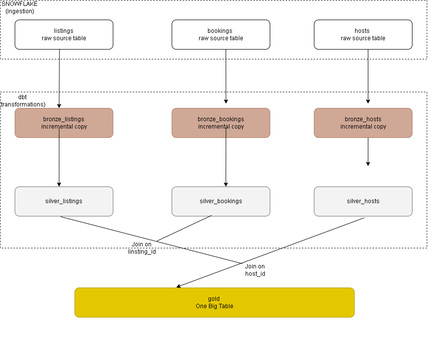

# Airbnb End-to-End OBT Data Warehouse

A DBT project that transforms raw Airbnb operational data (listings, hosts, bookings) into a single analytics-ready **One Big Table (OBT)** on Snowflake, using a Bronze → Silver → Gold medallion architecture.

## Architecture



| Layer | Schema | Materialization | Purpose |
|---|---|---|---|
| Bronze | `bronze` | `incremental` | Raw pass-through from `staging` source tables |
| Silver | `silver` | `incremental` | Cleaning, derived columns, business rules |
| Gold | `gold` | table (OBT) | OBT for reporting/BI |

## Data sources

Source tables are read from the `AIRBNB.staging` schema in Snowflake:

- `listings`
- `bookings`
- `hosts`

Defined in [`models/sources/sources.yml`](models/sources/sources.yml).

## Models

### Bronze (`models/bronze/`)
Incremental raw copies of each source table. Each model only pulls rows where `CREATED_AT` is newer than what's already loaded:

- `bronze_listings.sql`
- `bronze_bookings.sql`
- `bronze_hosts.sql`

### Silver (`models/silver/`)
Cleaned and enriched versions of the bronze tables:

- **`silver_listings.sql`** — tags each listing's `PRICE_PER_NIGHT` into `low` / `medium` / `high` bands via the `tag()` macro.
- **`silver_bookings.sql`** — computes `TOTAL_BOOKING_PRICE` (`NIGHTS_BOOKED × BOOKING_AMOUNT`) via the `multiply()` macro.
- **`silver_hosts.sql`** — derives a `RESPONSE_RATE_QUALITY` label (`VERY GOOD` / `GOOD` / `FAIR` / `POOR`) from each host's response rate.

### Gold (`models/gold/`)
- **`obt.sql`** — the One Big Table. Left-joins `silver_bookings` → `silver_listings` → `silver_hosts` into a single flattened table for downstream reporting.

There's also a standalone reference copy of the same join logic in [`scripts/one_big_table.sql`](scripts/one_big_table.sql).

## Macros (`macros/`)

| Macro | Description |
|---|---|
| `multiply(x, y, precision)` | Multiplies two columns and rounds to a given precision |
| `tag(col)` | Buckets a numeric column into `low` / `medium` / `high` |
| `generate_schema_name(...)` | Overrides dbt's default schema-naming behavior to use the custom schema as-is |
| `trimmer(column_name, node)` | Trims and uppercases a column *(currently references an undefined variable — needs a fix before use)* |

## Prerequisites

- [dbt-snowflake](https://docs.getdbt.com/docs/core/connect-data-platform/snowflake-setup)
- A Snowflake account with a database containing the `staging` schema/tables described above

Install dbt with the Snowflake adapter:

```bash
pip install dbt-snowflake
```

## Setup

> ⚠️ **Security note:** `profiles.yml` should **never** be committed to source control — it holds your Snowflake account, user, and password. dbt expects this file at `~/.dbt/profiles.yml`, outside your project directory. If you've already pushed real credentials, rotate that Snowflake password now and add `profiles.yml` to `.gitignore`.

1. Clone the repo:
   ```bash
   git clone https://github.com/Ranthumeng/Airbnb-End-to-End-OBT-Data-Warehouse.git
   cd Airbnb-End-to-End-OBT-Data-Warehouse
   ```
2. Move your Snowflake credentials to `~/.dbt/profiles.yml` (use `profiles.yml` in this repo only as a template):
   ```yaml
   aws_dbt_snowflake_project:
     outputs:
       dev:
         type: snowflake
         account: <your_account_locator>
         user: <your_username>
         password: <your_password>
         role: ACCOUNTADMIN
         database: AIRBNB
         warehouse: COMPUTE_WH
         schema: dbt_schema
         threads: 1
     target: dev
   ```
3. Check the connection:
   ```bash
   dbt debug
   ```

## Usage

Run the full pipeline (Bronze → Silver → Gold):

```bash
dbt run
```

Run a single layer:

```bash
dbt run --select bronze.*
dbt run --select silver.*
dbt run --select gold.*
```

Test and document:

```bash
dbt test
dbt docs generate
dbt docs serve
```

## Project structure

```
.
├── dbt_project.yml
├── profiles.yml            # template only — do not commit real credentials
├── macros/
│   ├── generate_schema_name.sql
│   ├── multiply.sql
│   ├── tag.sql
│   └── trimmer.sql
├── models/
│   ├── sources/
│   │   └── sources.yml
│   ├── bronze/
│   │   ├── bronze_listings.sql
│   │   ├── bronze_bookings.sql
│   │   └── bronze_hosts.sql
│   ├── silver/
│   │   ├── silver_listings.sql
│   │   ├── silver_bookings.sql
│   │   └── silver_hosts.sql
│   └── gold/
│       └── obt.sql
└── scripts/
    └── one_big_table.sql
```

## Tech stack

- **dbt** — transformation and orchestration
- **Snowflake** — cloud data warehouse
